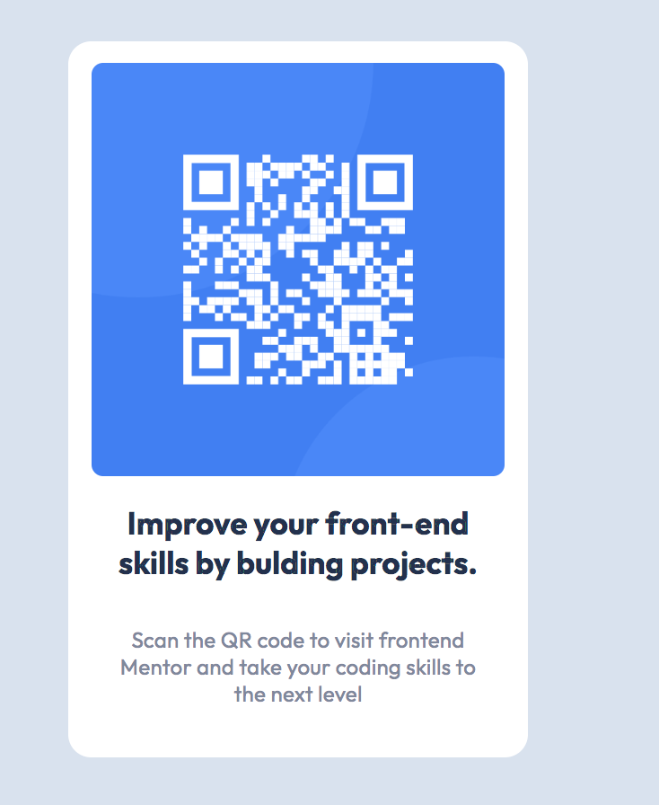

# Frontend Mentor - QR Code Project

## Table of contents

- [Overview](#overview)
  - [Screenshot](#screenshot)
  - [Links](#links)
- [My process](#my-process)
  - [Built with](#built-with)
  - [What I learned](#what-i-learned)
  - [Continued development](#continued-development)

## Overview

Simple project aimed to help solidify my understanding of flexbox and the box-model. Project idea and materials were optained from Frontend Mentor.

### Screenshot



### Links

- Solution URL: [https://github.com/rrebolledo90/qrcode.git]
  -Live Site URL: [https://rrebolledo90.github.io/qrcode/]

### Built with

- Semantic HTML5 markup
- CSS custom properties
- Flexbox
- Dev-tools
- Visual Studio Code

### What I learned

````css
Learned how to set relative font-familys using the @font-face rule. For example, font-family: ; src: url was something unfamilar to me. I found
that adding a relative pathway was more straightforward then directly linking to google's font library.

I studied up more on the box model, which helped me manipulate display: flex containers more easily, I did not understand that some element properties need to
be set before they will show with flexbox. I also learned how to set box-sizing: border-box; to the whole html docuement, which made sizing block elements much easier.

```devtools
Need to use this more, helped fine tune some difficulties I was having.

### Continued development

I need to continue working on my understanding of flexbox and the box model. I understand some of the basics but I still have difficulty arranging items next to each other, especially getting thier dimensions to match. I need to learn more about percentatges as well, which I have read help with responsive layouts.
````
